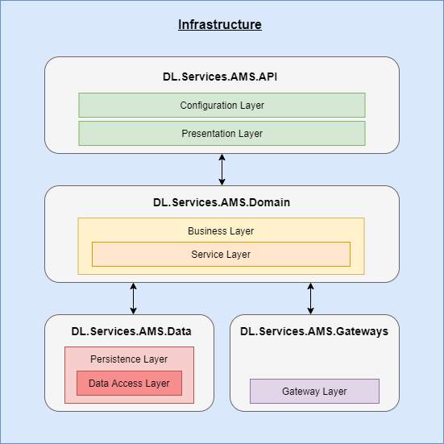
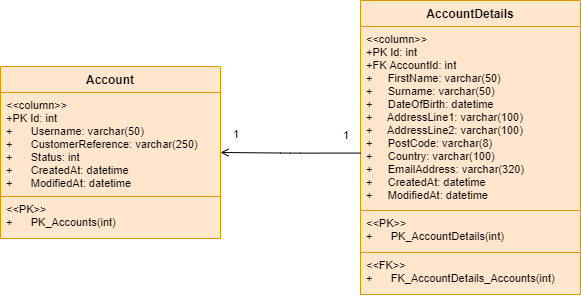

# Services_AccountManagementSystem_API
## Appsettings Configuration
```
{
  "Logging": {
    "LogLevel": {
      "Default": "Information",
      "Microsoft": "Warning",
      "Microsoft.Hosting.Lifetime": "Information"
    }
  },
  "AllowedHosts": "*",
  "ConnectionStrings": {
    "DatabaseConnection": "placeholder"
  }
}
```
#### Please note: Values have been blanked out for the purposes of this document. Integers have been set to 0, strings have been set to "placeholder" and boolean values have been set to false
---
## Infrastructure Diagram
##### The image below is a depiction of how the project class librabies will be constructed.


### DL.Services.AMS.API  
This class library is used to facilitate the presentation and configuration layer. The presentation layer is used to construct the code behind any UI pages and/or controls which present the content to the end user. While the configuration layer is used to configure any startup services needed for the application such as controller and dependency injection services (through the service collection).  In our project we create a REST API, each controller (Reference DL.Services.AMS.API .Controller) corresponds to the models we want to offer web services for. The controllers contain HTTP action methods to routed endpoints that define how the end user can get access to these service. Each method has request and response headers with their own HTTP information and status codes and links to a related use case for the required action. The injected UseCase factory is used to retrieve the corresponding action usecase and cuts down additional dependencies in the controllers constructor (facade could also be used here).

### DL.Services.AMS.Domain  
This class library is used to facilitate the business and service layers. They are used to instruct any real-world business rules that determine how data will be used and processed in the application. In our project the business rules are applied within the use cases (Reference DL.Services.AMS.Domain.UseCases) that outline the systems behavior as it responds to a request instructed through the API presentation layer and encapsulates how a set of objects interact (similar to the mediator pattern). Each use case represents a sequence of business related actions or tasks that decide how the end goal is achieved and fulfilled. These actions occur through services in-between the business layer, they provide a frequent set of application operations offered as an interface to clients and return the response of each operation. These interfaces can be found within the ports folder (Reference DL.Services.AMS.Domain.Ports) they represent the bridge between the difference class library projects. Each use case response also inherits a base response with a status code and reason, so correct validate with a HTTP status code can be applied and returned to the controller methods in the presentation layer.

### DL.Services.AMS.Data 
This class library is used to facilitate the data-access and persistence layer. They are used to manage the physical storage, retrieval of data and separation of data logic from your business entity objects. The data layer is the underlying database technology such as SQL Server. While the persistence layer is the set of code that manipulates the database like components/classes that are responsible for persisting data from the database such as Entity Framework, (DAO) Data-Access Object models linked to database tables, repositories and etc.  In our project, we use client/data managers (Reference DL.Services.AMS.Data.Managers) which act as a bridge between the domain and data layer libraries. The manager classes directly implement the interfaces setup in the domain.ports layer, so we can apply data-logic behavior within our methods of the manager classes implemented from interfaces. The managers will inject data related repositories to access the methods for retrieving a set of records from the database using Entity Framework to keep track of the models and their changes. It also injects a mapperfactory for retrieving the correct mappers (DL.Services.AMS.Data.Mappers), the mappers are used to map any data layer models back into business layer entities to ensure that the correct object and properties are returned from the service injected into the business layer use case.  

### Additional layers: Data.Services.AMS.Gateways
This class library is used to facilitate the gateways layer, which acts as a bridge to any internal/external clients for their services. 

---
## UML DB Model Relationship Diagram
##### The image below is a representation of the current/update-to-date database models. Use these as a reference to your DAO models in the data layer.


---
